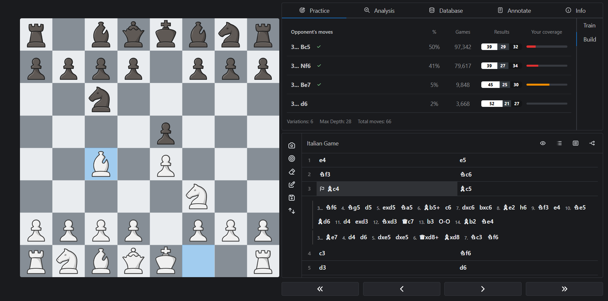
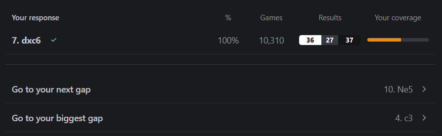
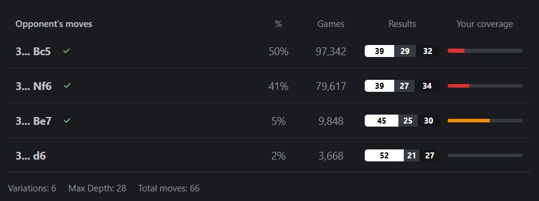
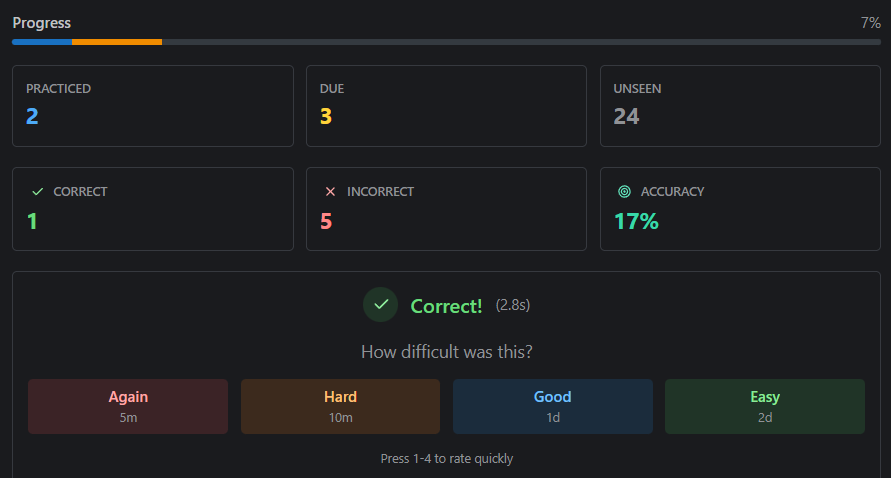

# Manage Repertoire

## What is a repertoire?

A repertoire is a collection of chess variations that you want to study, usually organized by opening. A repertoire is stored as a normal PGN file, but with dedicated Build and Train modes that help you both construct and memorize your lines.

## Creating a repertoire

The easiest way to create a repertoire is from the starting screen where you can click on the `Create Repertoire` button. Alternatively, go to the Files page, click on the `Create` button and select `Repertoire`. Once your file is open, you can start adding variations.

## Build mode

Before you can train, you need to build out your lines. Open your repertoire file and click `Build` in the side panel.

You should decide the starting position for your repertoire so that it only focus on the positions that actually matter. For example, if you're building a repertoire for the Ruy Lopez, you should make the moves `1.e4 e5 2.Nf3 Nc6 3.Bb5` and click the `Set as Start` button. This will make the position after `3.Bb5` the root of your repertoire tree.

Build mode shows you the most common moves played from each position, sourced from your reference database, along with their win rates and your current coverage. This information helps you prioritize which lines to build out first. You can click on any move to add it to your repertoire.

Additionally, you can use the `Go to your next gap` and `Go to your biggest gap` buttons to quickly navigate to positions that need attention.

#### Coverage

Coverage measures how deeply you've prepared responses to each opponent move. A variation is considered "completely covered" when you've extended it to a position with less games than the specified target in your settings. You can adjust this threshold in `Settings > Repertoire` to match how deep you need your preparation to be.

En Croissant also handles transpositions automatically. If a position can be reached via multiple move orders and you've already prepared it in one variation, it will be recognized as covered in the others too.

## Train mode

Once you've built out your lines, click `Train` to start drilling them. En Croissant will show you positions from your repertoire and ask you to find the correct move on the board.

After each move, you'll be asked to rate how easy it was to remember the move on a scale from 1 to 4. This spaced repetition system prioritizes moves you find difficult, so your study time is spent where it matters most. To speed up the process, you can also use keyboard shortcuts 1-4 to rate your recall without clicking.

The Progress bar at the top of the panel shows how much of your repertoire you've practiced in the current session, alongside stats for moves practiced, correct, incorrect, and your overall accuracy.

Once positions are due for review, a symbol will appear next to the file name in the Files page, prompting you to train again and keep the moves fresh in your memory.